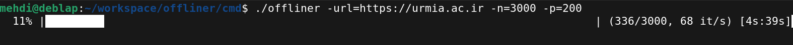

# offliner
Offliner is a tool to make a website offline viewable. It's a concurrent web crawler which crawls a website and saves all the pages and static files in a directory.<br>
It can use both, multi-processing & multi-threading as its concurrency model.



## Features
* Serial scraping.
* Multi-threaded scraping.
* Multi-process scraping.
* Save static files (css, js, img).
* Edit the links on the pages to reference the local files.
## Usage
You need to provide a full URL to start the scraping. You can use the defined flags to control the features. If you intend to use the multi-process form, the "process" program must exist in the same directory as the "offliner" program.
```
-h     show help.
-url   full URL of the start page.
-f     save static files too. It also edits the pages so the links reference the local files.
-a     use multi-processing instead of multi-threading as the concurrency model.
-n     maximum number of the pages to be saved. (default is 100)
-p     maximum number of the execution units (goroutines or processes) to run at the same time. (default is 50)
-s     run the scraper in a non-concurrent (serial) fashion.
```
## Examples
Multi-threaded scraping. Save max 100 pages using max 90 goroutines. Save static files too.
```
./offliner -url=https://urmia.ac.ir -n=100 -p=90 -f
```

Multi-process scraping. Save max 100 pages using max 50 processes.
```
./offliner -url=https://urmia.ac.ir -n=100 -p=50 -a
```

Serial scraping. Save max 100 pages. Save static files too.
```
./offliner -url=https://urmia.ac.ir -n=100 -s -f
```
## Todo
* Improve multi-processing design.
* Add a logger.
* Make the scraper a separate package (library).

## License
GNU General Public License v3.0
